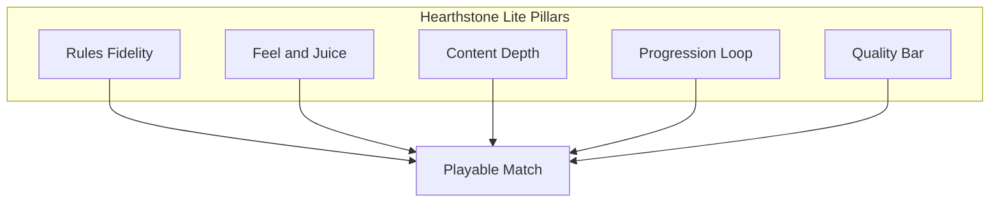

# LitStone → Hearthstone Lite Plan

This document defines what **Hearthstone Lite** means for LitStone and lays out a phased plan to get there. It complements [ROADMAP.md](ROADMAP.md) with concrete scope, priorities, and acceptance criteria.

---

## Audit Summary (June 2026 — updated)

LitStone is a **playable Hearthstone-style prototype** with 6 heroes, 109 collectable cards, career/tutorial/practice modes, SQLite session persistence, animations, SFX, responsive UI polish, and **193 tests** (`test_game_logic.py`, `test_career_playthrough.py`, `test_career_browser.py`).

### What already feels good

| Area | Status |
|------|--------|
| Core turn loop (mana, play, attack, hero power, end turn) | ✅ Complete |
| Keywords (Taunt, Divine Shield, Charge, Poisonous, Battlecry, Deathrattle, Silence) | ✅ Complete |
| Mulligan (player + AI), The Coin, first-player randomization | ✅ Complete |
| 30-card decks, per-session `game_id` | ✅ Complete |
| Class identity — 8 cards per hero + neutrals | ✅ Complete |
| Deck builder (filter, sort, search, curve, save/load, class pool) | ✅ Complete |
| In-match UX (mana HUD, help bar, collapsible log, mobile hand/tray) | ✅ Partial |
| Animations + Web Audio SFX (mute toggle) | ✅ Complete |
| Procedural card art — class-themed frames, motifs, tooltip previews | ✅ Complete |
| Rules tests | ✅ 193 tests in `test_game_logic.py` + `test_career_playthrough.py` + `test_career_browser.py` |

### Remaining gaps vs. Shippable Lite

| Gap | Impact |
|-----|--------|
| Procedural card frames (no bespoke illustrated art per card) | Good readability; less immersion than full art |
| Reduced random noise at Hard difficulty | Flat replay at Easy |
| Practice sandbox polish (deck presets, no-AI solo) | Nice-to-have |
| No discover / secrets / windfury / lifesteal | Missing HS texture |
| In-match card tooltips are hover-only (deck pool has tap preview) | Harder card preview on touch in duels |
| Illustrated card art (beyond procedural frames) | Less immersion |

---

## Defining "Hearthstone Lite"

**Hearthstone Lite** is not a clone of every expansion mechanic. It is a product that delivers the *feel* of Hearthstone in a browser:

1. **Pick a hero** with a distinct identity and power
2. **Build a 30-card deck** with curve and synergy
3. **Mulligan** into a playable opening hand
4. **Play a full match** with readable board state, satisfying feedback, and fair rules
5. **Beat AI** at multiple difficulty levels or scripted bosses
6. **Come back** via saved decks, optional progression, or new content

Out of scope for Lite (defer to v2+): ranked ladder, real-money economy, full collection grind, cross-platform accounts, esports.

---

## Target Experience Pillars

| Pillar | Lite target |
|--------|-------------|
| **Rules fidelity** | 30-card decks, 7-minion board, 10-card hand, fatigue, weapons, hero attacks |
| **Feel & juice** | Play/attack/death arcs, SFX, screen shake, readable combat log |
| **Content depth** | ~80–120 cards, class cards per hero, 3–5 boss encounters |
| **Progression loop** | All cards free *or* light unlock-by-wins; deck codes; AI difficulty |
| **Quality bar** | Mobile playable, no stale server state, CI on every push |

---

## Phased Plan

### Phase 1 — Match Fidelity (rules + session)

**Goal:** A single match should *feel* like Hearthstone structurally.

| Task | Details | Done when |
|------|---------|-----------|
| 30-card decks | Bump deck size; rebalance AI default decks and builder UI | Builder enforces 30; games last 8–15 turns on average |
| Standard mulligan | Player + AI: draw 3/4, replace any number once | Both sides mulligan before turn 1 |
| Coin / first player | Random who goes first; second player gets "The Coin" (temp +1 mana once) | Coin spell in hand, consumed on use |
| Session IDs | Replace global `GAME_STATE` with per-tab `game_id` (in-memory dict or SQLite) | Two browser tabs = two games |
| Resign / cleanup | ✅ `POST /api/resign` clears server state | Resign → new game works without refresh |
| Card text from server | ✅ `collectible_card_db()` enriches spells/battlecries/deathrattles via API | Client reads `desc_short` / `desc_long` with local fallback |

**Engine keywords to add (priority order):**

1. **Windfury** — attack twice per turn
2. **Lifesteal** — damage heals hero
3. **Discover** — pick 1 of 3 random cards (lite: from subset of pool)
4. **Secrets** — 1 hidden reactive spell slot (start with 2–3 secrets total)

---

### Phase 2 — Feel & Presentation (the "Hearthstone" in the name)

**Goal:** Players *feel* impact when cards hit the board.

| Task | Status |
|------|--------|
| Play animation — card arcs from hand to board | ✅ |
| Attack animation — minion lunges toward target | ✅ |
| Death animation — shard burst at last board position | ✅ |
| Hero weapon swing | ✅ |
| Sound design — Web Audio + mute toggle | ✅ |
| Board readability — larger minion slots on mobile | ⬜ |
| Loading states | ✅ (partial) |

**Art direction (lite):** Commission or generate **consistent card frames + silhouettes** per literary character. Emoji is fine for dev; Lite needs illustrated or styled SVG portraits at minimum.

---

### Phase 3 — Hero Identity & Content

**Goal:** Choosing Mage vs Warrior changes how you build and play.

| Task | Details |
|------|---------|
| Class-specific cards | 8–12 cards per class (only in that class's pool) |
| Neutral core set | ~40 neutrals usable by all |
| Rarity tiers | Common / Rare / Epic / Legendary (cosmetic frame + drop weight if collecting) |
| Shaman hero | Hero power: Totemic Call (summon random 0-cost totem) |
| Balance pass | Curve benchmarks per class; remove auto-win AI lines |
| Boss decks | 3 scripted AI bosses with unique hero powers and fixed decks |

**Content target for Lite launch:** **~100 cards** (61 neutral + 8×6 class cards — exceeded at 109).

---

### Phase 4 — AI & Single-Player Modes

**Goal:** Worth replaying without another human.

| Task | Status |
|------|--------|
| AI mulligan | ✅ |
| Difficulty tiers (Easy / Normal / Hard) | ✅ |
| AI deck building (mana curve) | ✅ |
| Boss decks (Frankenstein, Van Helsing, Moriarty) | ✅ |
| Career (6 chapters) | ✅ |
| Tutorial (3-step guided match) | ✅ |
| Practice mode (sandbox) | ✅ |

---

### Phase 5 — Persistence & Deploy

**Goal:** Shareable, stable, good enough to host.

| Task | Details |
|------|---------|
| SQLite game store | Persist active games; survive server restart | ✅ |
| Deck storage (server) | Optional account-less deck list via browser token | ⬜ |
| Environment config | `FLASK_DEBUG`, `PORT`, `SECRET_KEY` via env | ✅ |
| Docker image | `python:3.12-slim` + gunicorn | ✅ |
| CI pipeline | `unittest` + optional `ruff` on push | ✅ |
| Health endpoint | `GET /api/health` for uptime checks | ✅ |

---

### Phase 6 — Multiplayer Lite (optional stretch)

Only after Phases 1–4 feel great solo.

| Task | Details |
|------|---------|
| Room codes | Create/join 4-letter room |
| WebSockets | Flask-SocketIO or similar for real-time sync |
| Reconnect | Resume by room + player token |
| Spectate | Read-only state stream |

---

## Priority Matrix

| Priority | Work | Why |
|----------|------|-----|
| **P0** | 30-card decks, session IDs, AI mulligan | Structural HS fidelity |
| **P0** | Play/attack/death animations + basic SFX | Emotional payoff |
| **P1** | Class cards + Shaman | Hero identity |
| **P1** | AI difficulty + boss encounters | Replay value |
| **P1** | Mobile layout pass | Reach |
| **P2** | Discover, Secrets, Windfury | Depth without bloat |
| **P2** | SQLite persistence + Docker | Deployability |
| **P3** | Multiplayer | Network complexity |
| **P3** | Collection / quests / ranked | Retention systems |

---

## Suggested Milestones

| Milestone | Name | Exit criteria |
|-----------|------|---------------|
| **M1** | *Faithful Match* | 30 cards, mulligan both sides, coin, session IDs, 150+ tests |
| **M2** | *Juicy* | Animations + SFX + mobile deck builder usable on phone |
| **M3** | *Identity* | 100 cards, class restrictions, 3 bosses, AI difficulty |
| **M4** | *Shippable Lite* | Docker, CI, tutorial, campaign, hosted demo URL |
| **M5** | *Social* | Room-code multiplayer |

---

## Technical Notes

### Keep the architecture

The current split is correct:

- `game_logic.py` — pure rules (expand here first)
- `server.py` — thin HTTP layer
- `static/game.js` — presentation + input

Add new mechanics in Python with tests **before** wiring UI.

### Avoid early pitfalls

1. **Don't add React** until the vanilla UI blocks you — the CSS/JS base is already large and styled.
2. **Don't expose opponent hand** in API responses (already masked — keep it).
3. **Don't balance by gut** — log win rates per class vs AI at each difficulty.
4. **Don't ship 200 cards** before class identity exists — content without identity feels random.

### Test strategy expansion

| Layer | Tool | Focus |
|-------|------|-------|
| Rules | `unittest` / `pytest` | Every keyword, every spell effect |
| API | `pytest` + Flask test client | Illegal moves, session isolation |
| Frontend | Playwright (later) | Mulligan flow, targeting, mobile tap |

---

## Immediate Next Steps

1. ~~**30-card migration**~~ — ✅ `DECK_SIZE = 30`, builder UI, AI decks updated.
2. ~~**`game_id` sessions**~~ — ✅ UUID-keyed `GAMES` dict in `server.py`.
3. ~~**AI mulligan**~~ — ✅ `ai_choose_mulligan` / `ai_do_mulligan`.
4. ~~**The Coin + first player**~~ — ✅ random first player, coin to second.
5. ~~**Animation spike**~~ — ✅ play arc, attack lunge, death burst, weapon swing, spell flash.
6. ~~**Sound effects**~~ — ✅ Web Audio API with mute toggle (`localStorage`).
7. ~~**Class card schema**~~ — ✅ `"classes": ["Mage"]` on 48 class-exclusive cards; deck builder filters by hero.
8. ~~**Boss encounters**~~ — ✅ 3 scripted AI bosses with unique decks (Frankenstein, Van Helsing, Moriarty).

---

## Success Metrics

| Metric | Lite target |
|--------|-------------|
| Average game length | 8–15 turns |
| New player completes tutorial | > 80% |
| Mobile deck build (375px width) | No horizontal scroll |
| Unit test count | 193 (200+ stretch) |
| AI win rate vs default deck (Normal) | 45–55% |
| Lighthouse performance (desktop) | > 80 |

---

*This plan is a living document. Update it as milestones ship.*
